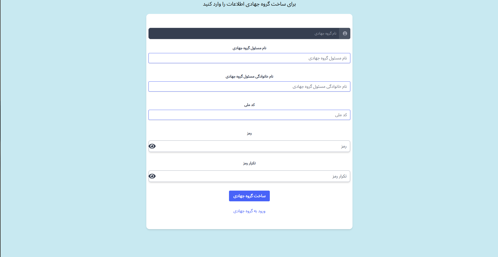
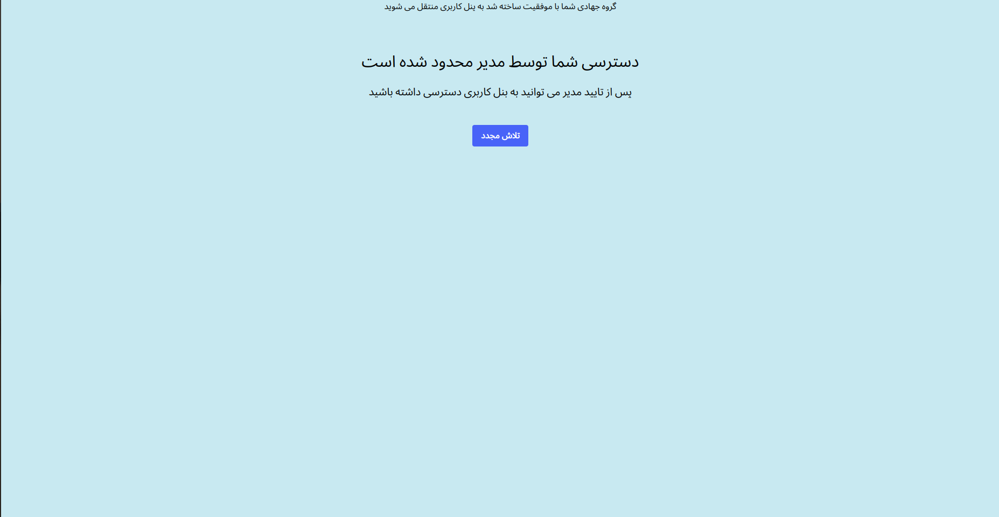
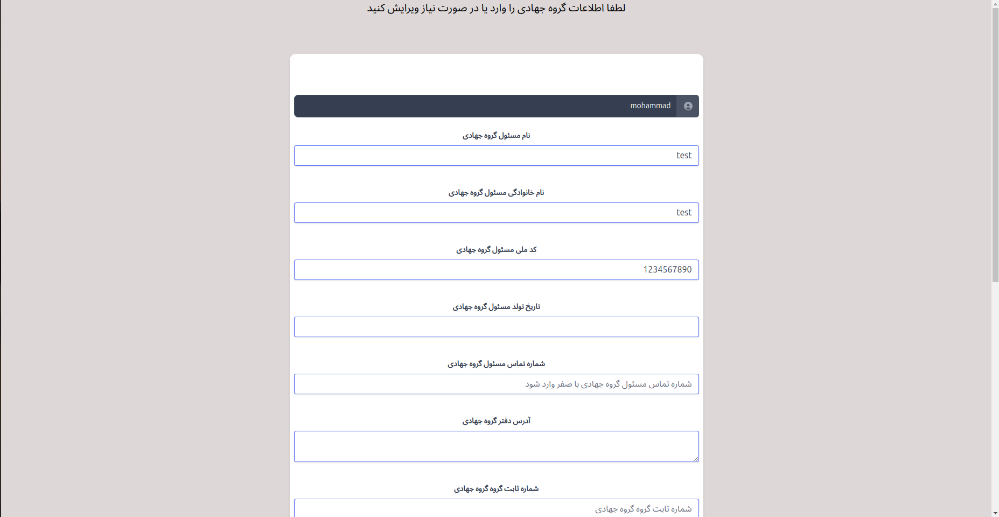
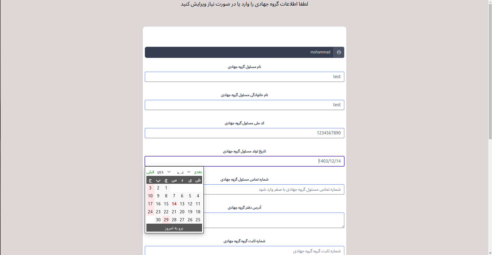
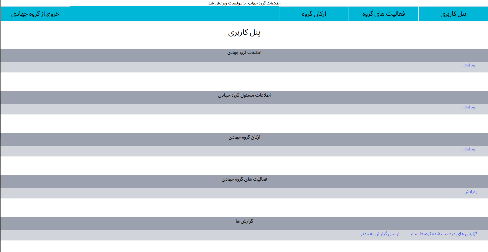

# Jahadi group organization system

Regulating jahadi groups and information on jahadi groups and camps

## How to run

1. Install python3, pip, virtualenv in your system.
2. Clone the project https://github.com/MohammadAminJorian/jahad.
3. Make development environment ready and run project using commands below;
git clone https://github.com/MohammadAminJorian/jahad && cd jahad
python venv  env  # Create virtualenv named env
source env/bin/activate
pip install -r requirements.txt
mv  sell_course/settings.py jahad/settings.py
python manage.py migrate  # Create database tables  
python manage.py runserver
 

1. Has has online purchase system
2. Has has an online course sales system
3. With approval number
4. Has a posting system 
and ...

 
 

# سامانه نظم دهی گروه های جهادی

نظم دهی گروه های جهادی و اطلاعات گروه های جهادی و قرار گاه ها

## اجرای کد

1. را در سیستم خود نصب کنید python3, pip, virtualenv 
2. پروژه را کلون کنید https://github.com/MohammadAminJorian/jahad.
3. محیط توسعه و پروژه را با استفاده از دستورات زیر آماده کنید. 
git clone https://github.com/MohammadAminJorian/jahad && cd jahad
python -m venv env # ایجاد کنید env را با نام  virtualenv 
اجرای محیط توسعه env/bin/activate 
pip install -r requires.txt 
sell_course/settings.py jahad/settings.py  
python manager.py migrate # جداول پایگاه داده ایجاد کنید 
python manager.py runserver  

1 .ثبت و ویرایش گروه های جهادی 
2 .ثبت و ویراش قرار گاه جهادی  
3 .ثبت و ویراش ارکان گروه جهادی  
4 . ارسال گذارش و فعالیت گروه های جهادی به مدیریت 
و...

 

 

 

 

 

